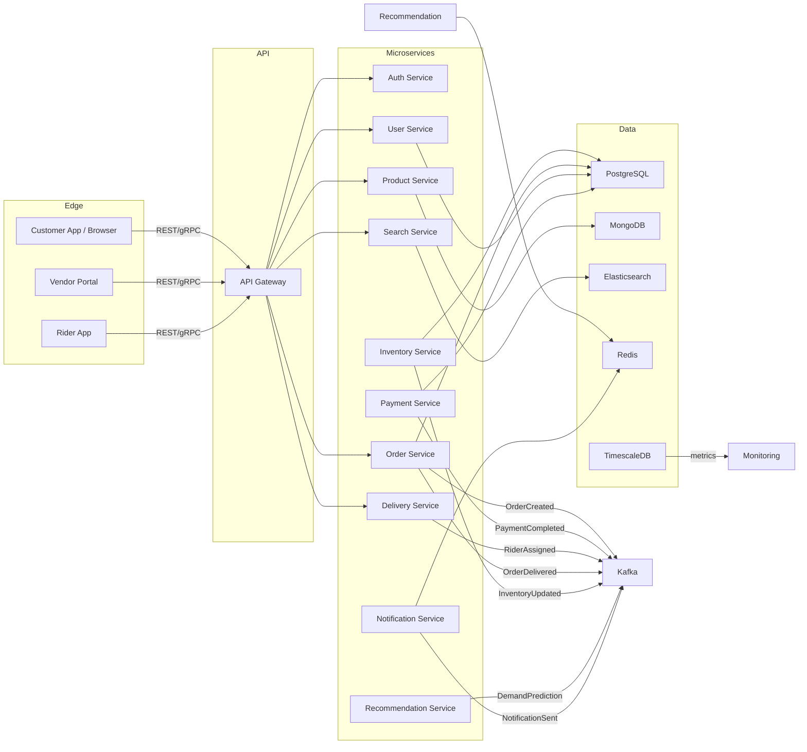

# Khanish Hyperlocal Commerce Platform - System Architecture

## 1. Executive Summary

This document defines a production-grade hyperlocal commerce platform for Grocery, Food, Pharmacy, Essentials, and Dark Store delivery. The system is designed for multi-city scale, high concurrency, low-latency delivery, and real-world operation patterns experienced in Blinkit, Zomato, Instamart, and Amazon Fresh.

Key attributes:
- Event-driven microservices architecture
- Geo-aware dark store and rider assignment
- Multi-domain catalog and inventory
- Real-time order/status streaming
- AI/ML recommendation and demand prediction
- Secure payments with Paytm, PhonePe, and COD support
- Elastic infrastructure on Kubernetes/AWS

---

## 2. Platform Scope

### Domains supported
- Grocery Delivery
- Food Delivery (Restaurants)
- Pharmacy Delivery
- Essentials (Electronics, Personal Care)
- Dark Store Fulfillment
- Recurring / Subscription Orders

### User journeys
- Discover products or menus via search
- Add items to smart cart
- Checkout with wallet/coupon options
- Track live delivery with ETA
- Schedule recurring subscription orders
- Place instant 10-minute hyperlocal orders where available

---

## 3. Actors

- **Customer**: Mobile/web shopper
- **Vendor**: Store or restaurant owner
- **Dark Store Manager**: Warehouse operator
- **Delivery Partner**: Rider
- **Fleet Manager**: Rider coordinator
- **Admin**: Operations leader
- **Support Agent**: Customer service
- **AI Recommendation Engine**: System actor for personalization

---

## 4. Core Microservices

### API Gateway
- Single entrypoint for customers, vendors, delivery, and admin
- Handles authentication, rate limiting, routing, and API versioning
- Edge caching for product catalog pages

### Auth Service
- OAuth2 / JWT issuance
- Multi-device login
- RBAC / ABAC for customers, vendors, riders, admins
- Session management / refresh tokens

### User Service
- Customer profile, addresses, loyalty, wallet
- Multi-address geofencing and verification
- Recurring order schedules

### Product Service
- Catalog metadata, images, brand, categories
- Product-based segmentation across grocery, pharmacy, essentials
- Collaborates with Search Service for indexing

### Inventory Service
- Multi-warehouse inventory state
- Geo-based nearest dark store selection
- Stock reservation and fallback logic
- Event sourcing of stock changes

### Order Service
- Transactional order lifecycle management
- Payment capture and status updates
- Order batching and rider assignment events
- Order state machine and audit logs

### Payment Service
- Wallet handling
- Third-party payment integrations (Paytm, PhonePe)
- COD processing and settlement flow
- PCI-ready tokenization and transaction audit

### Delivery Service
- Rider assignment and route optimization
- Real-time ETA and tracking
- Batch delivery & load balancing
- Geospatial zone and heatmap logic

### Recommendation Service
- AI-powered personalized recommendations
- Frequently bought together
- Demand forecasting and dynamic pricing triggers

### Search Service
- Elasticsearch for typo tolerant search
- Category filters, faceted search, relevant ranking
- Real-time index updates from Product/Inventory events

### Notification Service
- Push notifications, SMS, email
- Order updates, rider ETA, support alerts
- Event-driven notification orchestration

### Analytics / Monitoring Service
- TimescaleDB / Prometheus metrics
- Revenue, demand heatmaps, city operations dashboards
- Fraud detection and anomaly alerting

---

## 5. High-level Architecture Diagram



---

## 6. Event Flow

### Order lifecycle
1. Customer places order through API Gateway
2. Order Service validates cart, reserves inventory
3. Payment Service captures payment or marks COD
4. Inventory Service decrements stock
5. Delivery Service assigns nearest rider
6. Notification Service sends updates
7. Order Service publishes `OrderCreated`, `PaymentCompleted`, `RiderAssigned`, `OrderDelivered`

### Event-driven communication
- `OrderCreated` → Inventory Service, Delivery Service, Search Service, Recommendation Service
- `PaymentCompleted` → Order Service, Notification Service, Accounting Service
- `InventoryUpdated` → Search Service, Recommendation Service
- `RiderAssigned` → Notification Service, Fleet Manager UI
- `OrderDelivered` → Customer history, loyalty points, analytics

---

## 7. Database Design

### Polyglot persistence
- **PostgreSQL**: transactional data
  - users, orders, addresses, riders, vendors, payments, subscriptions
- **MongoDB**: catalog, product metadata, vendor menus
- **Redis**: sessions, caching, inventory lookups, recommendation state
- **Elasticsearch**: search indexing, auto-complete, filter queries
- **TimescaleDB**: time-series metrics, ETA history, demand forecasting

### Key tables and documents

#### PostgreSQL
- `users(user_id, name, email, phone, wallet_balance, loyalty_points, roles)`
- `addresses(address_id, user_id, city, lat, lon, type, verified)`
- `orders(order_id, user_id, vendor_id, total_amount, status, payment_mode, scheduled_at, created_at)`
- `order_items(order_item_id, order_id, product_id, qty, unit_price, status)`
- `vendors(vendor_id, name, type, location, rating, status)`
- `riders(rider_id, name, status, location, region_id)`
- `warehouses(warehouse_id, city, lat, lon, capacity, zone)`
- `payments(payment_id, order_id, provider, amount, status, transaction_ref)`
- `subscriptions(subscription_id, user_id, frequency, next_run, status)`

#### MongoDB
- `products({ _id, sku, title, categories, variants, price, description, attributes, media, vendorId, availability })`
- `menus({ _id, restaurantId, items, cuisineTypes, availableTimes })`
- `inventorySnapshots({ warehouseId, productId, quantity, reserved, updatedAt })`

#### Elasticsearch
- product index: title, categories, tags, vendor, city, price, rating, availability
- typo tolerant analyzers, n-gram tokenization, synonym filters

#### Redis
- `cart:{userId}`
- `session:{token}`
- `inventory:geo:{warehouseId}`
- `rider:availability:{zone}`
- `realTime:order:{orderId}`

---

## 8. API Documentation

### Customer APIs

```http
POST /api/v1/auth/login
POST /api/v1/auth/refresh
GET /api/v1/products?category=&q=&city=&sort=&priceMax=
GET /api/v1/products/{productId}
POST /api/v1/cart
GET /api/v1/cart
POST /api/v1/order
GET /api/v1/order/{orderId}
POST /api/v1/order/{orderId}/track
POST /api/v1/wallet/topup
POST /api/v1/subscription
```

### Vendor APIs

```http
POST /api/v1/vendor/login
GET /api/v1/vendor/dashboard
PUT /api/v1/vendor/inventory
POST /api/v1/vendor/pricing
GET /api/v1/vendor/orders
```

### Delivery APIs

```http
POST /api/v1/delivery/assign
GET /api/v1/delivery/rider/{riderId}/status
POST /api/v1/delivery/{orderId}/update
```

### Admin APIs

```http
GET /api/v1/admin/metrics
POST /api/v1/admin/surge
GET /api/v1/admin/cities
```

---

## 9. Search & Recommendation

### Search Service
- Elasticsearch with fuzzy matching, synonyms, category boosting
- Real-time index refresh from Inventory and Product events
- Auto-complete, voice search support, multi-lingual queries

### Recommendation Service
- Collaborative filtering and item-based suggestions
- Frequently bought together and bundle suggestions
- Demand prediction using area-level historical orders
- Personalized homepage sections

---

## 10. Delivery Optimization

### Core features
- Nearest warehouse selection via geo-spatial queries
- Dijkstra/A* routing for rider path planning
- Batch delivery of multiple orders
- ETA prediction from historical rider and traffic data
- Auto re-routing on order or rider change

### Delivery assignment workflow
1. Order ready
2. Closest rider pool selected
3. Load and route optimized
4. Batch size and delivery window computed
5. Rider receives assignment, customer receives ETA

---

## 11. Security & Compliance

- OAuth2 / JWT for customer/vendor/auth token flows
- RBAC with fine-grained policy enforcement
- TLS for all transport
- Data encryption at rest in PostgreSQL and MongoDB
- Payment processing with vendor tokenization and PCI-ready design
- Fraud detection based on behavioral anomaly scoring

---

## 12. Scalability & Infrastructure

### Cloud stack
- Kubernetes (EKS) for microservice orchestration
- AWS RDS for PostgreSQL on Multi-AZ
- AWS ElastiCache Redis
- Elasticsearch Service / OpenSearch
- S3 for media and static assets
- CloudFront CDN for frontend
- EKS Fargate or node groups for service scaling

### Scaling strategy
- Horizontal autoscaling for stateless services
- Read replicas for PostgreSQL and Elasticsearch
- Redis caching for hot product and session data
- Circuit breakers and rate limiting at API Gateway
- CDN offloading for static assets and images

---

## 13. Observability & DevOps

- GitHub Actions CI/CD for build/test/deploy
- Helm charts for Kubernetes deployment
- Prometheus + Grafana for metrics
- ELK stack for logs
- k6 / JMeter load tests for peak traffic validation
- Chaos experiments for resiliency

---

## 14. Recommended Folder Structure

```text
khanish-platform/
├── frontend/
│   ├── web-client/
│   ├── rider-app/
│   └── vendor-portal/
├── backend/
│   ├── auth-service/
│   ├── user-service/
│   ├── product-service/
│   ├── inventory-service/
│   ├── order-service/
│   ├── payment-service/
│   ├── delivery-service/
│   ├── recommendation-service/
│   ├── search-service/
│   ├── notification-service/
│   └── admin-service/
├── infra/
│   ├── k8s/
│   ├── terraform/
│   └── ci-cd/
└── docs/
```

---

## 15. Key Production-grade Code Snippets

### Auth JWT generation (Node.js)

```js
const jwt = require('jsonwebtoken');
const signToken = (user) => jwt.sign({ sub: user.id, roles: user.roles }, process.env.JWT_SECRET, { expiresIn: '15m' });
```

### Order creation transaction (Node.js / PostgreSQL)

```js
await db.transaction(async (trx) => {
  const order = await trx('orders').insert({ user_id, total_amount, status: 'PENDING', payment_mode }) .returning('*');
  await trx('order_items').insert(items.map(item => ({ order_id: order.id, product_id: item.id, qty: item.qty, unit_price: item.price })));
  await trx('inventory').whereIn('product_id', items.map(i => i.id)).decrement('available_qty', knex.raw('?', [item.qty]));
});
```

### Delivery assignment pseudo-code

```js
const candidateRiders = await riderService.findAvailableRiders(zoneId);
const bestMatch = routeOptimizer.chooseBest(candidateRiders, orderLocation);
await deliveryService.assign(orderId, bestMatch.id);
```

---

## 16. Deployment Plan

1. Build frontend container and deploy to S3 / CloudFront
2. Deploy microservices into Kubernetes namespace
3. Provision PostgreSQL, MongoDB, Redis, Elasticsearch
4. Configure Kafka / RabbitMQ event mesh
5. Deploy API Gateway and ingress
6. Run smoke tests for core flows
7. Enable autoscaling and monitoring

---

## 17. Next Step Recommendations

1. Implement backend microservice skeletons for Auth, Order, Delivery, Inventory, and Search.
2. Build a real-time Socket.io / WebSocket layer for tracking.
3. Add Elasticsearch indexing and inventory geo-partitioning.
4. Add simulation engine for 10-minute delivery availability and rider batching.
5. Implement CI/CD, observability, and chaos testing.

---

## 18. Conclusion

This design is aligned with top-tier hyperlocal commerce platforms. It supports multi-city growth, real-time order streaming, AI-driven personalization, high availability, and production-grade security.
